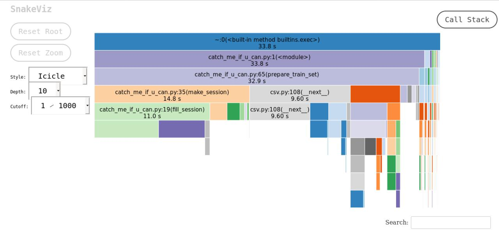

```
/home/fedor/PycharmProjects/avito_last/venv/bin/python -m pytest /home/fedor/PycharmProjects/avito_last/test_catch.py
============================= test session starts ==============================
platform linux -- Python 3.7.3, pytest-5.4.2, py-1.8.1, pluggy-0.13.1
rootdir: /home/fedor/PycharmProjects/avito_last
collected 4 items

test_catch.py ....                                                       [100%]

============================== 4 passed in 0.64s ===============================

Process finished with exit code 0
                                                                                                                                                    [100%]
```



